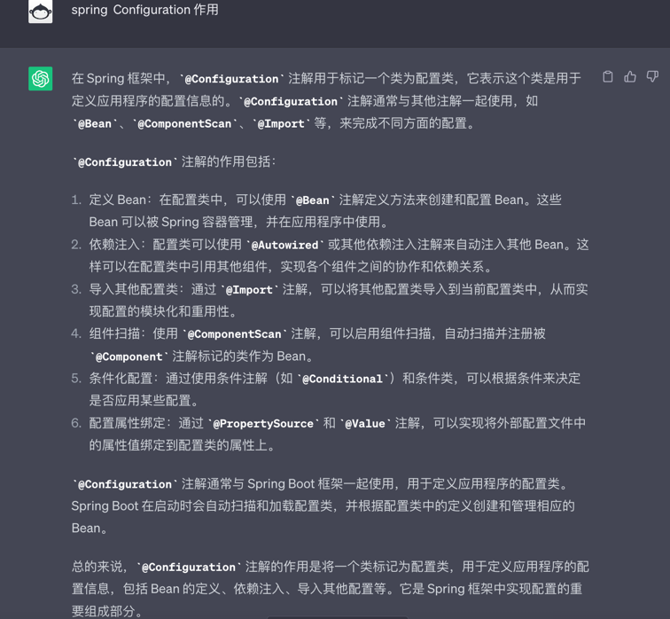

## spring boot

### 依赖注入

```
依赖注入：配置类可以使用 @Autowired 或其他依赖注入注解来自动注入其他 Bean。
这样可以在配置类中引用其他组件，实现各个组件之间的协作和依赖关系。

当 Autowired 找到多个bean，需要指定一个bean使用，默认情况spring boot 会报错 
    1. @Qualifier("bean1")
    2. @Primary
```



### ioc

```
管理实例化后的实例容器, 默认是单例
```

### 常用注解

```
# Component&&Bean
@Component 注解用于标记类为一个组件，通过自动扫描和注册的方式将其作为 Bean 注册到 Spring 容器中
@Bean 注解用于在配置类中显式地声明和配置 Bean，可以根据需要进行更细粒度的控制和配置。两者在使用方式和作用范围上有一些差异，你可以根据具体需求选择适合的注解来创建和配置 Bean

# value
实现将外部配置文件中的属性值绑定到配置类的属性上
```
